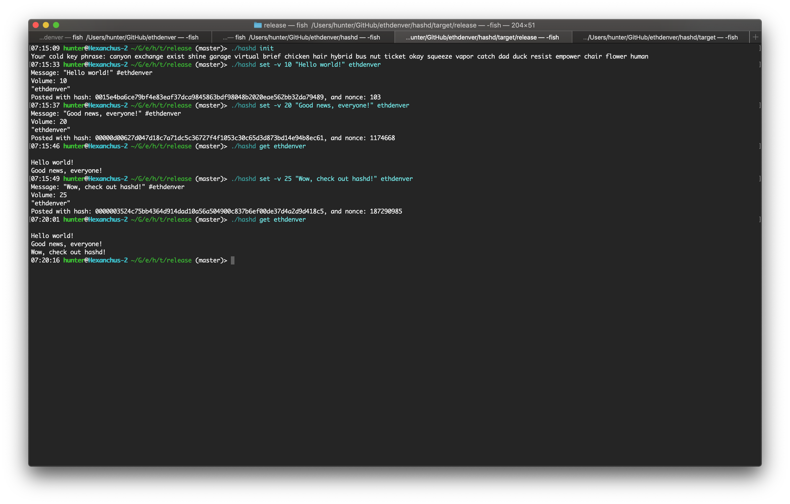

# hashd

hashd (or #D) is a database protected by proof of work. This is the Rust implementation. There also exists a Python implementation, and a reference spec.

[hashd spec](https://github.com/Harryman/hashd)

